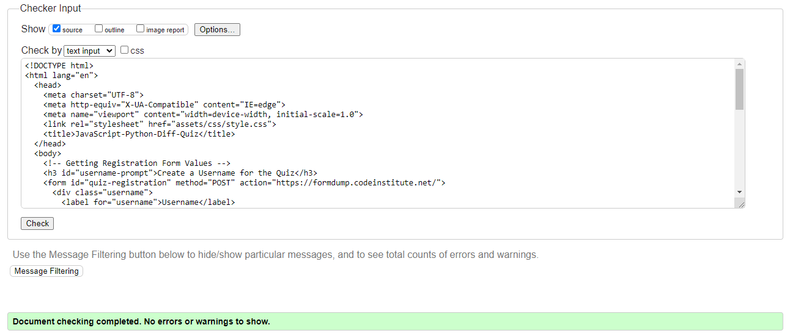
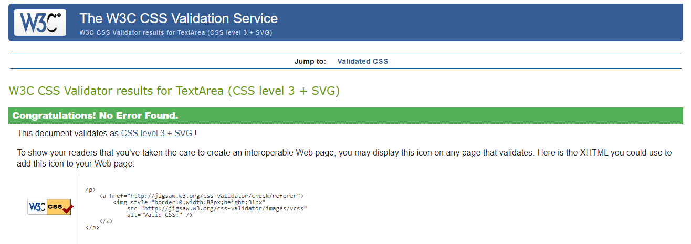
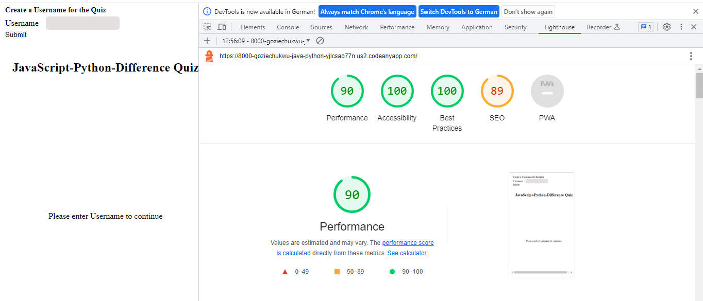

# JavaScript-Python-Diff-Quiz

JavaScript-Python-Diff-Quiz is an online-quiz site that hopes to help people clearly know the differences between JavaScript and Python in terms of their features and applications, through testing the user in a short-quiz about their differences. The site will be targeted towards all kinds of people, but especially towards software developers and computer scientists who would want to know what language (JavaScript or Python) would be more appropriate for use in a particular design target. JavaScript-Python-Diff-Quiz will be useful in making the user get a good grasp of the features, ecosystems, libraries and strengths of both languages which will aid the user in making an informed decision on what language to use for the specific target of design.

## Using JavaScript-Python-Diff-Quiz

Upon visiting JavaScript-Python-Diff-Quiz's website, the user will see a prompt to input a username for the quiz in a form at the top left of the screen. Below the prompt, at the center of the page, the user sees the first quiz question. The website is of a single page and is responsive to all device sizes and works effectively on all types of browsers.

Source: [Responsivity measurement](https://ui.dev/amiresponsive?url=%20https://goziechukwu.github.io/Java-Python-Diff-Quiz/)

## Features

### SignUp Form

The SignUp Form is located at the top left of the website page, and contains a field for the user to register a username for the quiz.

### Question Section

The Question Section is located at the center of the page, just below the title head of the page. It contains the question serial number, the question and the options (choices) to select from. The options are placed in buttons below the question.

When the user hovers the mouse around an option button, it turns yellow in color. When the user then clicks the button, a prompt immediately shows at the top of the website page, telling the user if the chosen option was correct or wrong; at the same time, the score of the user for the quiz question is saved.

After the user finishes answering the last question, the website page then shows the user's username and the obtained score.

## Technologies Used

The website was designed using the following programming languages:

- HTML5

- CSS3
  
- JAVASCRIPT

The Codeanywhere workspace was used to write the code. 

• All the codes, README and the commits were pushed to GitHub repository

• The fonts used were obtained from the Google Fonts library in google

## Validation Testing

The author has tested the website's user interface and has found out that it looks the same on the browsers- Google Chrome, Mozilla Firefox and Microsoft.

The HTML and CSS codes have been tested for validation in the w3C HTML Validator and the w3C (Jigsaw) CSS Validator respectively, and no errors were returned.

The JavaScript code has been tested for validation in the JSLint Validator and the warnings it gave: _"Unexpected trailing space"_, _"Line is more than 80 characters long" (especially for the comments)_, can be ignored, because they help to improve the readability of the code.

## Accessibility Requirements

JavaScript-Python-Diff-Quiz has been tested using Lighthouse on Google and found to completely meet Accessibility Requirements, in addition to having Best Practices, and more, as indicated in the screenshot below:

## File Structure

Folders and Files in the workspace are created as follows:

Folders: - Assets folder

Contents: - CSS folder, JS folder and Images folder.

Files: - index.html, style.css (in the CSS folder) and script.js (in the JS folder) files.

## Deployment

The site was deployed to GitHub pages by the following steps:
Navigating in the GitHub repository to the Settings tab,
Clicking the drop-down menu under the source section and selecting 'Master Branch', and finally waiting for the page to refresh and display a detailed ribbon sign indicating that deployment was successful.

This brought forth, under the Pages section under Settings, JavaScript-Python-Diff-Quiz's live link which is as follows:

<https://goziechukwu.github.io/Java-Python-Diff-Quiz/>

## Contact information

The website developer's contact details are as below:

Email: inekwegoziechukwu@gmail.com

## Acknowledgements and References

- _Structure of my README_: Most of the writing structure of this README document was obtained from my(the author's) former website: [Decor Awesome](https://goziechukwu.github.io/decor-awesome/).

- _JavaScript Logic_: The logic used in the javascript was a collection of a mix of my(the author's) Personal Ideas, ideas from my Mentor at Code Institute and ideas from [Chat GPT 3.5](https://chat.openai.com/).

- _Google Fonts_: The two fonts, Oswald and Lato used in the website design were obtained from [Google Fonts](https://fonts.google.com/).

- _Code Institute Form Dump Url_: The [Code Institute's Form Dump url](https://formdump.codeinstitute.net/) was used in my code for the posting of the form in the 'signup.html'.