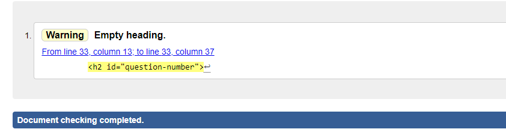
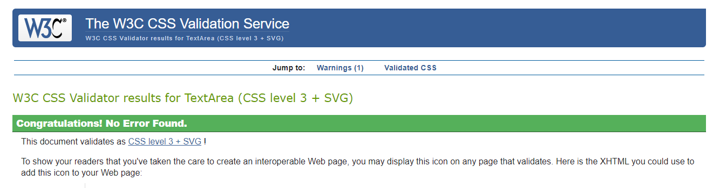
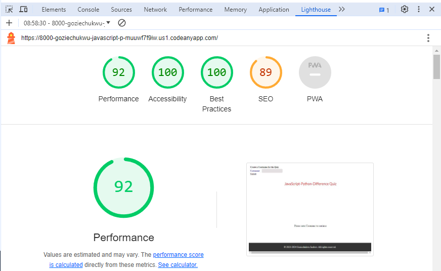

# JavaScript-Python-Diff-Quiz

JavaScript-Python-Diff-Quiz is an online-quiz site that hopes to help people grasp clearly the differences between JavaScript and Python in terms of their features, libraries, packages and applications, through testing the user in a short-quiz about their differences. The site will be targeted towards all kinds of people, but especially towards software developers and computer scientists who would want to know what language and its libraries would be the applicable for a particular feature in a design target. JavaScript-Python-Diff-Quiz will be useful in making the user get a good grasp of the features, ecosystems, libraries and strengths of both languages which will aid the user in carrying out full-stack projects.

## Using JavaScript-Python-Diff-Quiz

Upon visiting JavaScript-Python-Diff-Quiz's website, the user will be greeted with the homepage, where lies a prompt to input the user's name for the quiz in a form at the top left of the screen. The quiz cannot begin except a user inputs a username. After inputing a username, the questions open with the first quiz question. The user has just two options for each question to make a single choice, they are: "JavaScript" and "Python". The website is of a single page and the question load dynamically one after the other, when the user clicks the "NEXT" button that appears everytime an option is selected. JavaScript-Python-Diff-Quiz is responsive to all device sizes and works effectively on all types of browsers.

Source: [Responsivity measurement](https://ui.dev/amiresponsive?url=https://goziechukwu.github.io/JavaScript-Python-Diff-Quiz/)

## Features

### SignUp Form

The SignUp Form is located at the top left of the website page, and contains a field for the user to register a username for the quiz. The form only appears before the Quiz starts and disappears when the quiz begins.

### Question Section

The Question Section is located at the center of the page, just below the title head of the page. It contains the question serial number, the question and the options (choices) to select from. The options are placed in buttons below the question.

When the user hovers the mouse around an option button, it turns yellow in color. When the user then clicks the choice's button, a prompt immediately shows below the option buttons, telling the user if the chosen option was correct or wrong; at the same time, button to go to the next question appears.

The user can only select a choice for a question and only once. At each point of selection, the score of the user is recorded and his total score is presented at the end of the quiz, after the last question is answered. The user's final score will indicate how many questions were answered correctly out of the total number of questions.

## Technologies Used

The website was designed using the following programming languages:

- HTML5

- CSS3
  
- JAVASCRIPT

- [Google Fonts](https://fonts.google.com/) was used to obtain the two fonts, Oswald and Lato used in the website.

The Codeanywhere workspace was used to write the code. 

• All the codes, README and the commits were pushed to GitHub repository

## Validation Testing

The author has tested the website's user interface and has found out that it looks the same on the browsers- Google Chrome, Mozilla Firefox and Microsoft.

The HTML and CSS codes have been tested for validation in the w3C HTML Validator and the w3C (Jigsaw) CSS Validator respectively, and no errors were returned.

The HTML code was tested by direct input in the w3C Nu HTML Validator

The CSS code was tested by direct input in the w3C (Jigsaw) CSS Validator

The JavaScript code has been tested for validation in the JSLint Validator and the warnings it gave: like: _"Line is more than 80 characters long" (especially for the comments)_, can be ignored, because they help to improve the readability of the code.

## Accessibility Requirements

JavaScript-Python-Diff-Quiz has been tested using Lighthouse on Google and found to completely meet Accessibility Requirements, in addition to having Best Practices, and more, as indicated in the screenshot below:

## Wireframes

The skeletal structure of the User Interface that focus on the arrangement of the elements and the overall user flow can be seen in the image below:

## File Structure

Folders and Files in the workspace are created as follows:

Folders: - Assets folder

Contents: - CSS folder, JS folder and Images folder.

Files: - index.html, style.css (in the CSS folder) and script.js (in the JS folder) files.

## Deployment

The site was deployed to GitHub pages by the following steps:
- Navigating in the GitHub repository to the Settings tab,
- Clicking the drop-down menu under the source section and selecting 'Master Branch', and then
- waiting for the page to refresh and display a detailed ribbon sign indicating that deployment was successful.

This brought forth, under the Pages section under Settings, JavaScript-Python-Diff-Quiz's live link which is as follows:

<https://goziechukwu.github.io/JavaScript-Python-Diff-Quiz/>

## Contact information

The website developer's contact details are as below:

Email: inekwegoziechukwu@gmail.com

## Acknowledgements and References

- _Source of Quiz Questions_: Most of the questions and answers were generated from [Google](https://www.google.com/) and restructured by me.

- _JavaScript Logic_: The logic used in the javascript was a mix of a collection of my(the author's) Personal Ideas, ideas from my Mentor at Code Institute and ideas from [Chat GPT 3.5](https://chat.openai.com/).

